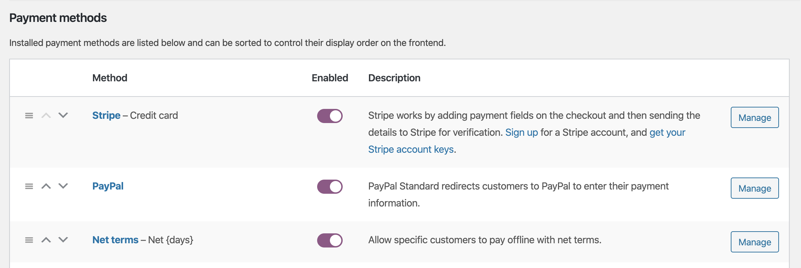
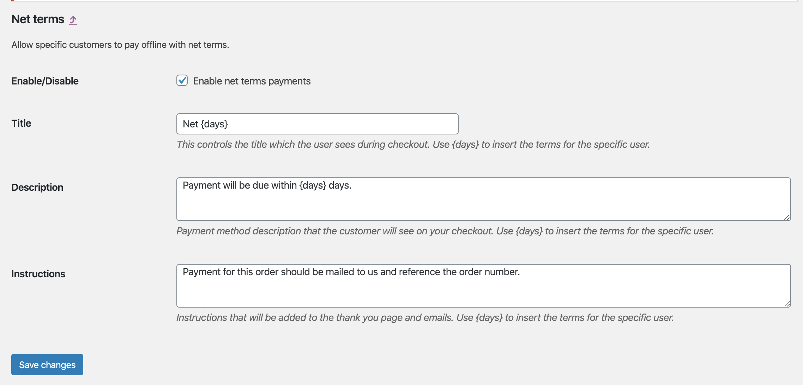
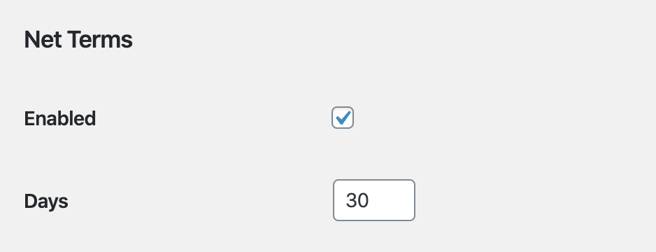
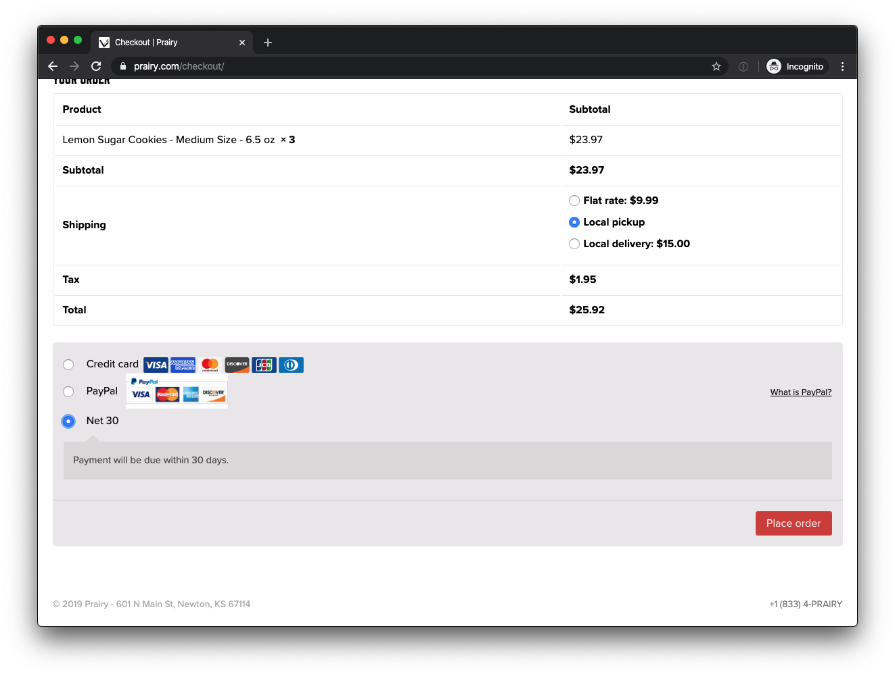
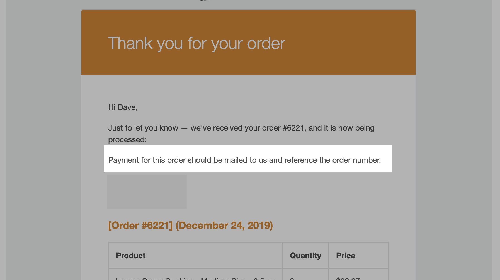
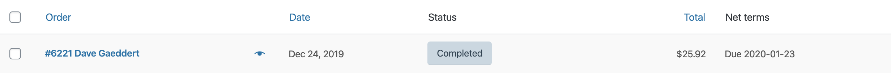
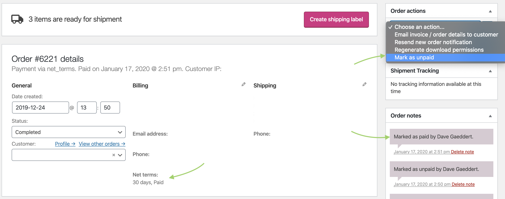
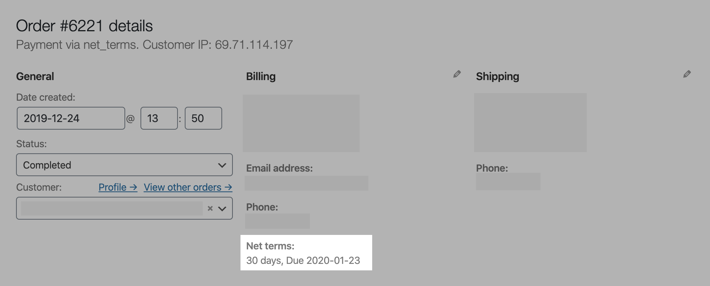
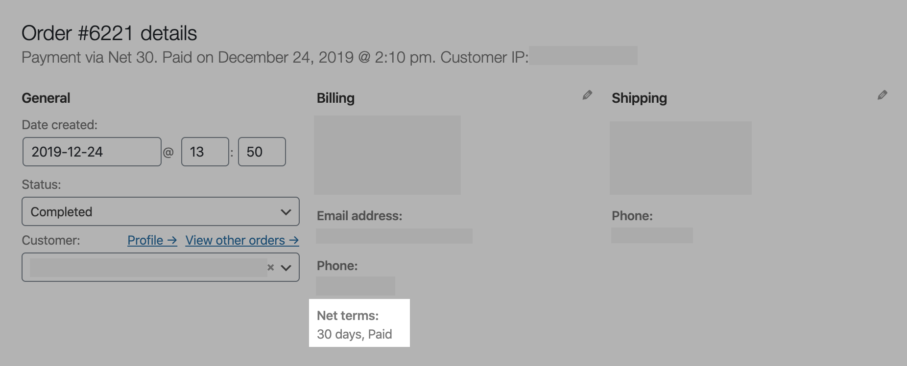

# Net Terms Payment Method for WooCommerce

A WordPres plugin that adds a "net terms" payment method to WooCommerce.
It allows you to enable net terms on a per-customer basis and specify the terms for each customer.
Orders get processed like normal,
and you mark them as paid once you receive payment (i.e. a check in the mail).

One of the differences between this and the built-in check payments option is that the order is not "on-hold" while you wait for payment. Instead,
orders get processed and shipped as usual,
and you mark the order as "paid" at a later date.
Note that this plugin still expects that you get paid offline (likely via check) or through some other system.

## How it works

Install the plugin to add the Net terms payment method.

If needed, edit the payment method settings to change what you want users to see.
The instructions field will be shown after checkout and included in the order emails to the customer.

Enable the net terms payment option for individual customers (WordPress admin -> Users -> choose an existing customer).

Chosen customers can then select net terms in checkout.
You can change the name and description of this in the payment method settings.

The net terms "instructions" will be shown after the customer places an order, and when they get an order email.

A new column will be added to the Orders admin so that you can see which orders have net terms and which have been paid (which will simply say "Paid").

As an admin, you can mark individual orders as paid when you receive payment.
The order notes will also keep a history of who marked orders as paid (or unpaid) and when.

